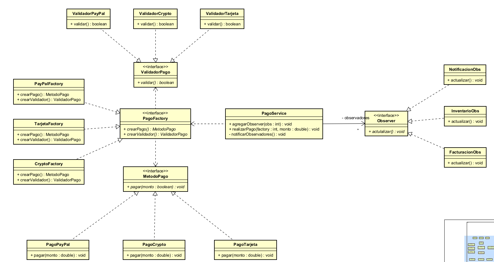
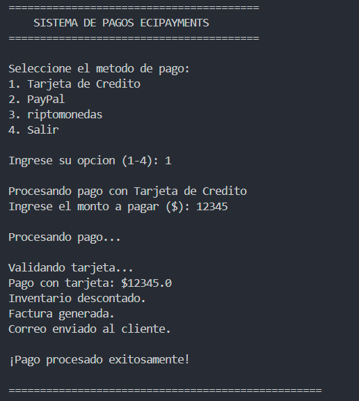
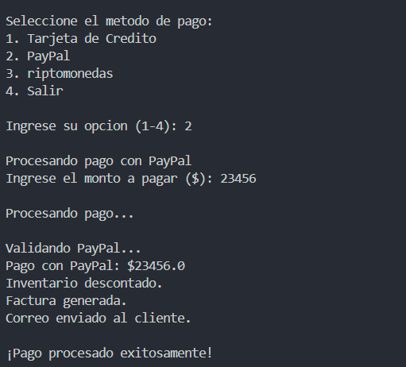
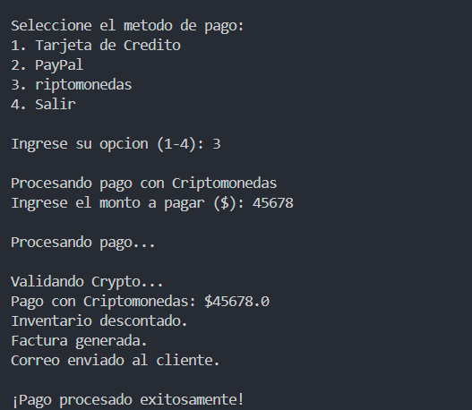
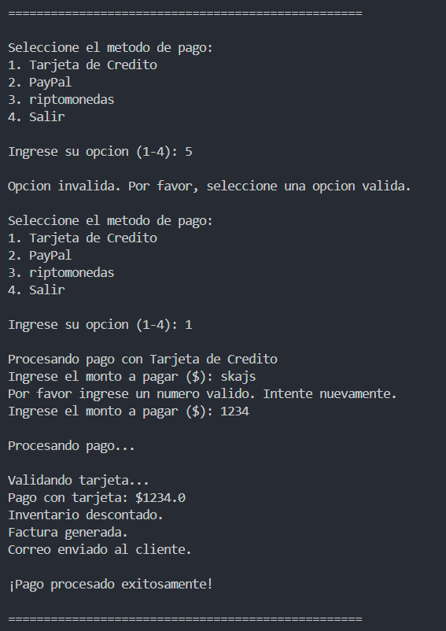
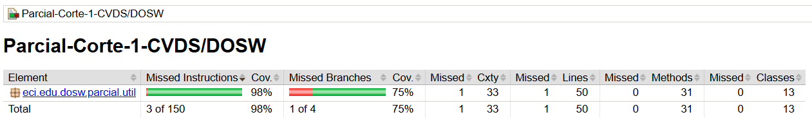
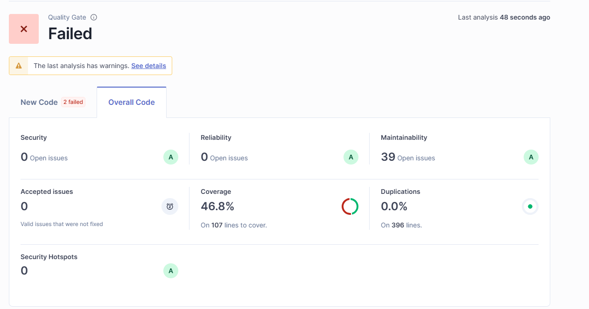

## 3. Diagrama de Clases y Principios SOLID

### Diagrama de Clases

### Principios SOLID Aplicados

#### **S - Single Responsibility Principle (SRP)**
- **Componente:** Cada clase tiene una única responsabilidad
  - `PagoTarjeta`, `PagoPayPal`, `PagoCrypto`: Cada una maneja únicamente su método de pago específico
  - `ValidadorTarjeta`, `ValidadorPayPal`, `ValidadorCrypto`: Cada validador se encarga únicamente de validar su tipo de pago
  - `InventarioObs`, `FacturacionObs`, `NotificacionObs`: Cada observer maneja una funcionalidad específica del negocio

#### **O - Open/Closed Principle (OCP)**
- **Componente:** Interfaces `MetodoPago`, `PagoFactory`, `ValidadorPago`, `Observer`
- **Implementación:** El sistema está abierto para extensión (se pueden agregar nuevos métodos de pago) pero cerrado para modificación (no se necesita cambiar el código existente)

#### **L - Liskov Substitution Principle (LSP)**
- **Componente:** Todas las implementaciones concretas pueden ser sustituidas por sus interfaces
- **Ejemplo:** Cualquier `PagoFactory` puede ser usada en `PagoService.realizarPago()` sin alterar el comportamiento

#### **I - Interface Segregation Principle (ISP)**
- **Componente:** Interfaces específicas y cohesivas
- **Implementación:** 
  - `MetodoPago` solo define el método `pagar()`
  - `ValidadorPago` solo define el método `validar()`
  - `Observer` solo define el método `actualizar()`

#### **D - Dependency Inversion Principle (DIP)**
- **Componente:** `PagoService` depende de abstracciones, no de concreciones
- **Implementación:** `PagoService` trabaja con interfaces (`PagoFactory`, `Observer`) en lugar de clases concretas

## 4. Patrones de Diseño Implementados

### 4.1 Patrón Abstract Factory

#### a. Nombre del Patrón
**Abstract Factory (Factory Abstracto)**

#### b. Tipo de Patrón
**Creacional**

#### c. Argumentación
Este patrón se utiliza para crear familias de objetos relacionados sin especificar sus clases concretas. En nuestro sistema:

- **Problema que resuelve:** Necesitamos crear tanto el método de pago como su validador correspondiente de manera coherente
- **Implementación:** 
  - `PagoFactory` (Abstract Factory): Define la interfaz para crear productos relacionados
  - `TarjetaFactory`, `PayPalFactory`, `CryptoFactory` (Concrete Factories): Implementan la creación de familias específicas
  - Productos creados: `MetodoPago` + `ValidadorPago` correspondiente
- **Beneficio:** Garantiza que siempre se use el validador correcto para cada método de pago
- **Reflejo en el diagrama:** Se observan las interfaces factory y sus implementaciones concretas, cada una creando una familia coherente de objetos

### 4.2 Patrón Observer

#### a. Nombre del Patrón
**Observer (Observador)**

#### b. Tipo de Patrón
**De Comportamiento**

#### c. Argumentación
Este patrón define una dependencia uno-a-muchos entre objetos, de manera que cuando un objeto cambia de estado, todos sus dependientes son notificados automáticamente.

- **Problema que resuelve:** Cuando se realiza un pago exitoso, múltiples módulos del sistema (inventario, facturación, notificaciones) necesitan ser notificados
- **Implementación:**
  - `Observer` (Subject Interface): Define la interfaz para los observadores
  - `PagoService` (Concrete Subject): Mantiene la lista de observadores y los notifica
  - `InventarioObs`, `FacturacionObs`, `NotificacionObs` (Concrete Observers): Implementan las acciones específicas a realizar
- **Beneficio:** Desacopla el sistema de pagos de los módulos que necesitan ser notificados, permitiendo agregar nuevos módulos sin modificar el código existente
- **Reflejo en el diagrama:** Se observa `PagoService` manteniendo una lista de `Observer` y el método `notificarObservadores()` que actualiza todos los observadores registrados

## 5. Evidencias de implemetacion y ejecucion: 

## 6 y 7. Implementacion de pruebas unitarias y cobertura con Jacoco:

## 8. Analisis estatico con Sonnar:  

[text](README.md) 